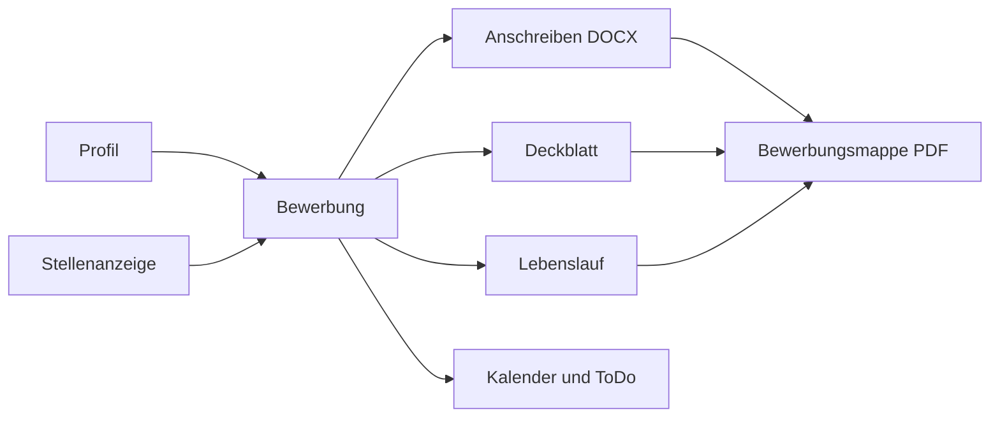
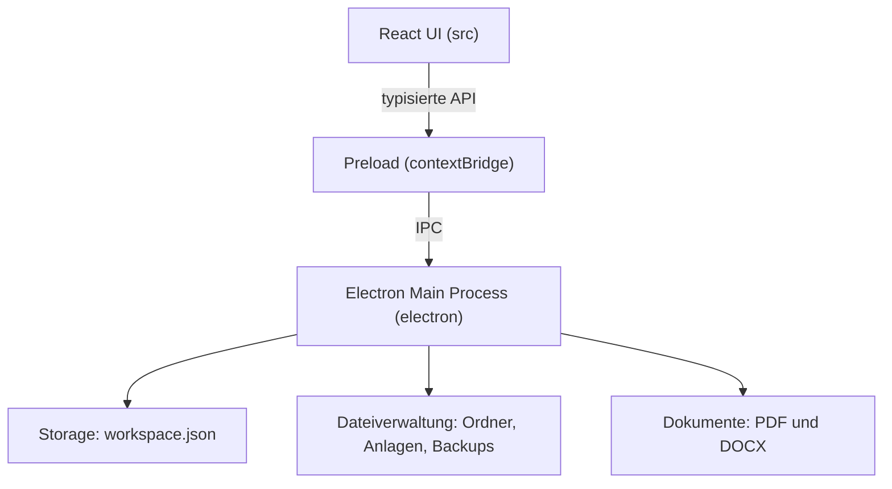

# BewerbungsManager

> Lokale Desktop-Anwendung zur strukturierten Verwaltung und Erstellung von Bewerbungen.

[](https://github.com/mustafa-oezdemir/bewerbung_manager/actions/workflows/ci.yml)
[](https://github.com/mustafa-oezdemir/bewerbung_manager/releases/latest)
[](LICENSE)


BewerbungsManager unterstützt den vollständigen Bewerbungsworkflow: von Stellenanzeige und Profil über Anschreiben,
Deckblatt und Lebenslauf bis zu Bewerbungsmappe, Kalender und Aufgabenverwaltung. Alle Daten liegen lokal auf dem
eigenen Rechner.

## Überblick

Jede Bewerbung ist ein Datensatz aus Firma, Stelle, Status und Terminen. Unterlagen werden aus dem gewählten Profil
und den Bewerbungsdaten erzeugt, sodass Anschreiben, Deckblatt, Lebenslauf und Mappe dieselben Angaben verwenden.



Die Oberfläche ist auf Deutsch. Gebaut und veröffentlicht wird ausschließlich für Windows (x64).

## Funktionen

### Bewerbung

- Bewerbungs-Assistent mit Validierung; ein angefangener Entwurf wird lokal zwischengespeichert
- Firma, Ansprechpartner und Stelle mit Referenz, Quelle, Link, Anzeigentext, Arbeitsmodell, Vertragsart und Gehalt
- Statusverlauf von *Entwurf* bis *Zusage*, *Absage*, *Zurückgezogen* oder *Archiviert*; Absagen mit Begründung
- Mehrere Bewerberprofile; jede Bewerbung verwendet genau ein Profil für alle ihre Dokumente
- Dashboard mit Statuszahlen und Erfolgsquote, Suche und Filter über alle Bewerbungen
- Abgleich der Stellenanzeige mit den Kenntnissen im Profil

### Dokumente

- **Anschreiben** als editierbare Word-Datei (DOCX) aus einer Vorlage, befüllt mit den Bewerbungsdaten
- **Deckblatt** in drei Designs (Klassisch, Pastell, Akzentband); Vorschau und PDF nutzen dieselbe Darstellung
- **Lebenslauf** in mehreren Designs mit Editor für Abschnitte (ein- und ausblendbar, sortierbar) und automatischem
  Seitenumbruch
- **Bewerbungsmappe** als ein zusammengeführtes PDF: Deckblatt, Anschreiben, Lebenslauf, Zeugnisse, Zertifikate
- **Anlagen:** Zeugnisse und Zertifikate liegen einmal zentral als PDF und werden pro Bewerbung nur verknüpft
- E-Mail-Text zur Bewerbung als Markdown-Datei

### Organisation

- **Kalender** als Monats- und Agendaansicht; Termine entstehen automatisch aus Bewerbungs-, Gesprächs-,
  Vertrags- und Fristdaten
- **Bewerbungsfrist** erscheint im Kalender und als automatische Aufgabe im ToDo
- **ToDo** mit Priorität, Fälligkeit und Notiz; Aufgaben zu Bewerbungen und eigene Aufgaben sind getrennt filterbar.
  Bei Absage, Zusage, Rücknahme oder Archivierung werden die Aufgaben der Bewerbung nicht mehr als aktiv geführt
- Erinnerung zum Nachfassen nach einer einstellbaren Anzahl von Tagen
- Desktop-Benachrichtigungen für Kalendertermine mit Erinnerung; fällige Aufgaben zeigt das Benachrichtigungsmenü der App

### Desktop & Daten

- Lokale Datenspeicherung in einem frei wählbaren Ordner
- Automatische Sicherungen (eine pro Tag, einstellbare Aufbewahrung) sowie Export und Import per JSON
- Hell-, Dunkel- und Systemdesign
- Windows-Installer und portable Version
- Optionale Git-Automatisierung (siehe [Daten & Datenschutz](#daten--datenschutz))

## Technologie

| Bereich | Technologie |
| --- | --- |
| Desktop | Electron |
| Oberfläche | React, Tailwind CSS |
| Sprache | TypeScript (strict) |
| Build | Vite, electron-builder |
| State | Zustand |
| Validierung | Zod |
| Dokumente | docxtemplater und PizZip (DOCX), pdf-lib (PDF-Zusammenführung) |
| Tests | Vitest |

Die genauen Versionen stehen in [`bewerbung-studio/package.json`](bewerbung-studio/package.json).

## Architektur



- **Oberfläche:** React-Views in `src/views`, gemeinsamer Zustand in Zustand-Stores
- **Preload:** stellt dem Renderer nur freigegebene, typisierte Methoden bereit
- **Main Process:** Dateisystem, Dialoge, PDF-Export, Benachrichtigungen und der zentrale Datenspeicher
- **Geteilter Code:** Schemas (Zod), Fachregeln und Seitenumbruch in `src/shared` werden von Oberfläche und Main
  Process gemeinsam genutzt, damit Vorschau und PDF übereinstimmen
- **Sicherheit:** `contextIsolation` und `sandbox` sind aktiv, `nodeIntegration` ist aus; externe Links sind auf
  HTTP/HTTPS beschränkt

## Voraussetzungen

- Windows 10 oder neuer (x64)
- Für die Entwicklung: [Node.js](https://nodejs.org/) 24 (wie in der CI) und npm
- Git

## Installation

### Fertige Version

Die aktuelle Version steht unter [Releases](https://github.com/mustafa-oezdemir/bewerbung_manager/releases/latest):

- `BewerbungsManager-<Version>-x64-Setup.exe`: Installer
- `BewerbungsManager-<Version>-x64-Portable.exe`: läuft ohne Installation
- `SHA256SUMS.txt`: Prüfsummen der Dateien

Die veröffentlichten Windows-Dateien sind derzeit nicht code-signiert; Windows SmartScreen kann deshalb warnen.
Prüfe vor dem Start die Prüfsumme, zum Beispiel mit `Get-FileHash <Datei> -Algorithm SHA256`.

### Aus dem Quellcode

```bash
git clone https://github.com/mustafa-oezdemir/bewerbung_manager.git
cd bewerbung_manager/bewerbung-studio
npm ci
npm run dev
```

## Entwicklung

`npm run dev` startet Vite mit dem Electron-Plugin: Oberfläche und Main Process werden gebaut und die
Desktop-Anwendung öffnet sich. `npm start` startet dagegen die bereits gebaute Anwendung (`electron .`) und braucht
vorher `npm run build`.

Nur die Oberfläche im Browser, ohne Electron:

```bash
# PowerShell
$env:VITE_RENDERER_ONLY="1"; npm run dev
```

Für Entwicklung und Tests lässt sich der Datenordner über die Umgebungsvariable `BEWERBUNG_ROOT_PATH` setzen.
Verwende dafür nie deine echten Bewerbungsdaten.

## Verfügbare npm-Skripte

Alle Skripte laufen in `bewerbung-studio`.

| Befehl | Zweck |
| --- | --- |
| `npm run dev` | Entwicklungsmodus mit Electron |
| `npm start` | Gebaute Electron-Anwendung starten |
| `npm run typecheck` | TypeScript prüfen |
| `npm test` | Tests ausführen (Vitest) |
| `npm run build` | Typprüfung und Production Build |
| `npm run release:check` | Typecheck, Tests und Build |
| `npm run dist:win` | Windows-Release erzeugen (Setup, Portable, Prüfsummen) |
| `npm run dist:win:signed` | Wie `dist:win`, mit Code-Signing (Zertifikat nötig) |
| `npm run dist:win:installer` | Nur den Installer bauen |
| `npm run dist:win:portable` | Nur die portable Version bauen |

## Daten & Datenschutz

BewerbungsManager verarbeitet persönliche Daten wie Adresse, Telefonnummer, E-Mail, Lebenslauf, Zeugnisse und
Bewerbungsunterlagen.

- Die Daten liegen lokal im gewählten Bewerbungsordner. Es gibt kein Benutzerkonto und keine Cloud-Synchronisierung;
  der Code enthält keine Telemetrie und keinen automatischen Update-Abruf.
- Beim ersten Start wählst du den Bewerbungsordner; der Pfad wird in `bootstrap.json` im Electron-`userData`-Ordner
  gespeichert. Den Ordner kannst du später in den Einstellungen wechseln, vorher wird eine Sicherung erstellt.
- Die optionale Git-Automatisierung ist nur aktiv, wenn der Bewerbungsordner bereits ein Git-Repository ist. Sie
  committet Änderungen, setzt `origin` auf das im Code fest hinterlegte Repository (`APPLICATION_DATA_REMOTE` in
  `bewerbung-studio/electron/git-automation.ts`) und pusht dorthin. Mache den Bewerbungsordner deshalb nur dann zu
  einem Git-Repository, wenn du das ausdrücklich willst, und passe vorher das Ziel an.
- **Committe keine echten Bewerbungsdaten in dieses Repository** und veröffentliche sie nicht in Issues oder Pull
  Requests. Die `.gitignore` schließt die Datenordner aus; prüfe trotzdem vor jedem Commit, was du hinzufügst.

## Ordnerstruktur

Struktur des Bewerbungsordners:

```text
<Bewerbungsordner>
└── data
    ├── Bewerbungen
    │   └── Firma_JJJJ-MM-TT              Firma und Bewerbungsdatum
    │       └── Stellenbezeichnung        eine Stelle pro Unterordner
    │           ├── Anschreiben
    │           ├── Lebenslauf
    │           ├── Deckblatt
    │           ├── Email
    │           ├── Stellenanzeige
    │           └── Bewerbungsunterlagen
    ├── Zeugnisse
    ├── Zertifikate
    ├── Absagen
    └── Setting
        ├── Settings                      workspace.json (zentraler Datensatz)
        ├── Profile
        ├── Backups
        └── Muster                        Vorlagen
```

Weitere Hintergründe zur Ablage stehen in [`bewerbung-studio/README.md`](bewerbung-studio/README.md).

## PDF- und Dokumentexport

- Der PDF-Export nutzt `printToPDF` von Electron. Vorschau und PDF verwenden dieselbe Darstellung und dieselbe
  Seitenumbruch-Logik.
- Das Anschreiben wird als DOCX aus einer Vorlage erzeugt und bleibt in Word bearbeitbar.
- Die Bewerbungsmappe wird mit pdf-lib aus den einzelnen PDFs zusammengeführt.
- Mitgelieferte Word-Muster für den Lebenslauf liegen in
  [`bewerbung-studio/public/templates`](bewerbung-studio/public/templates), zum Beispiel:

<p>
  
  
  
</p>

## CI/CD

Die Workflows liegen in [`.github/workflows`](.github/workflows).

**CI** ([`ci.yml`](.github/workflows/ci.yml)): bei jedem Pull Request und Push auf `main`

```text
npm ci → npm run release:check (Typecheck → Tests → Build)
```

**Release** ([`release.yml`](.github/workflows/release.yml)): bei einem Tag `vX.Y.Z` oder manuell

```text
Tag und package.json-Version prüfen → release:check → Windows-Build (Setup und Portable)
→ SHA-256-Prüfsummen prüfen → Workflow-Artefakt → GitHub Release (nur für einen Tag)
```

Ohne hinterlegte Signing-Secrets baut der Workflow unsignierte Dateien.

## Windows Release

```bash
cd bewerbung-studio
npm run dist:win
```

Das Ergebnis liegt in `bewerbung-studio/windows-release`. Checkliste, Signierung und den GitHub-Actions-Ablauf
beschreibt [RELEASE.md](bewerbung-studio/RELEASE.md).

## Tests

```bash
cd bewerbung-studio
npm test
```

Die Tests laufen mit Vitest und liegen neben dem Code (`*.test.ts` und `*.test.tsx`). Sie prüfen unter anderem
Schemas, Speicherlogik, Dokumenterzeugung und Seitenumbruch. Vor einem Pull Request sollte `npm run release:check`
durchlaufen.

## Projektstruktur

```text
bewerbung_manager
├── .github
│   ├── ISSUE_TEMPLATE
│   ├── workflows
│   └── pull_request_template.md
├── bewerbung-studio
│   ├── electron            Main Process, Speicher, Dateien, PDF, Vorlagen
│   ├── src
│   │   ├── views           Dashboard, Bewerbungen, Kalender, ToDo, Dokumente, Profil
│   │   ├── components      Assistent, Lebenslauf-Vorlagen, Deckblatt
│   │   └── shared          Schemas, Fachregeln, Seitenumbruch
│   ├── scripts             Release-Build, Prüfsummen, QA-Skripte
│   ├── public/templates    Word-Muster
│   ├── package.json
│   └── RELEASE.md
├── CODE_OF_CONDUCT.md
├── CONTRIBUTING.md
├── LICENSE
├── NOTICE
├── README.md
└── SECURITY.md
```

## Mitwirken

Beiträge sind willkommen. Details stehen in [CONTRIBUTING.md](CONTRIBUTING.md). Es gilt der
[Verhaltenskodex](CODE_OF_CONDUCT.md).

## Sicherheit

Sicherheitslücken bitte nicht als öffentliche Issue melden. Siehe [SECURITY.md](SECURITY.md).

## Lizenz

Dieses Projekt ist unter der Apache License 2.0 lizenziert.

Siehe [LICENSE](LICENSE) und [NOTICE](NOTICE).
