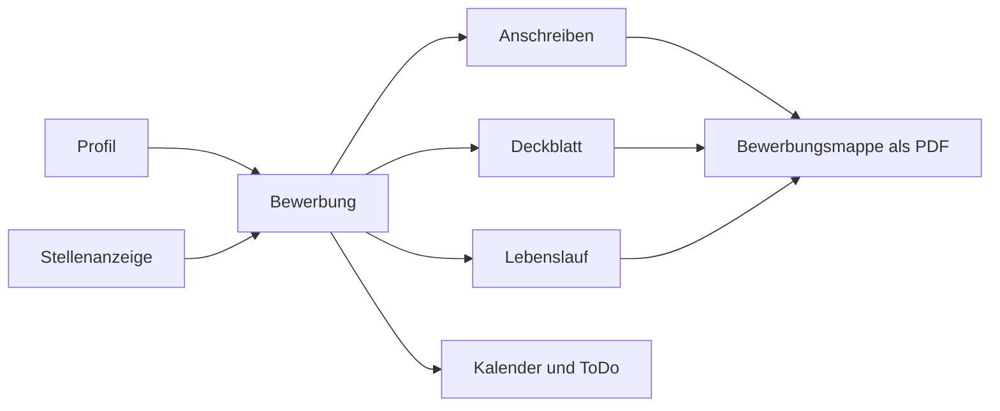

<div align="center">


# BewerbungsManager

**Deine Bewerbungen an einem Ort: verwalten, Unterlagen erstellen, Fristen im Blick behalten.**

Lokale Desktop-App für den deutschen Bewerbungsprozess. Ohne Cloud, ohne Konto.

[](https://github.com/mustafa-oezdemir/bewerbung_manager/actions/workflows/ci.yml)
[](https://github.com/mustafa-oezdemir/bewerbung_manager/releases/latest)


[Download](#download) · [Funktionen](#funktionen) · [Datenablage](#datenablage) · [Entwicklung](#entwicklung)

</div>

---

## Warum BewerbungsManager?

Wer sich auf mehrere Stellen bewirbt, verliert schnell den Überblick: Welche Version des Lebenslaufs ging an
wen? Wann läuft die Frist ab? Wo liegt das Anschreiben? BewerbungsManager führt alles in **einem lokalen
Datensatz** zusammen. Aus dem Profil und der Stellenanzeige entstehen Deckblatt, Anschreiben, Lebenslauf und die
fertige Bewerbungsmappe als PDF. Termine und Aufgaben ergeben sich aus dem Stand der Bewerbung.



## Download

Die aktuelle Version steht unter **[Releases](https://github.com/mustafa-oezdemir/bewerbung_manager/releases/latest)**:

| Datei | Wofür |
| --- | --- |
| `BewerbungsManager-<Version>-x64-Setup.exe` | Installer mit Startmenü-Eintrag |
| `BewerbungsManager-<Version>-x64-Portable.exe` | Startet ohne Installation, z. B. vom USB-Stick |
| `SHA256SUMS.txt` | Prüfsummen der beiden Dateien |

Prüfsumme kontrollieren (PowerShell):

```powershell
Get-FileHash .\BewerbungsManager-1.0.1-x64-Setup.exe -Algorithm SHA256
```

> [!NOTE]
> Die Windows-Programme sind derzeit **nicht code-signiert**. Windows SmartScreen kann deshalb beim ersten Start
> warnen (*Weitere Informationen → Trotzdem ausführen*). Vergleiche vorher die Prüfsumme.

Beim ersten Start wählst du einen Bewerbungsordner. Die App legt dort alles ab (siehe [Datenablage](#datenablage)).

## Funktionen

### Bewerbungen verwalten

- **Bewerbungs-Assistent** mit Validierung und automatisch zwischengespeichertem Entwurf
- **Statusverlauf** von Entwurf über Gespräch bis Zusage, Absage oder Archiv; ein Statuswechsel aktualisiert
  Termine und Aufgaben und ordnet Dateien ein (z. B. ins Absagen-Archiv)
- **Dashboard** mit Statuszahlen, Erfolgsquote, anstehenden Terminen und Fristen
- **Suche und Filter** über alle Bewerbungen, auch in der Kopfleiste
- **Stellenanzeigen-Abgleich** gegen die Kenntnisse in deinem Profil
- Mehrere **Profile**: Jede Bewerbung nutzt genau ein Profil als Quelle für Anschreiben, Deckblatt, Lebenslauf
  und Mappe

### Unterlagen erstellen

| Dokument | Was du bekommst |
| --- | --- |
| **Anschreiben** | Editierbare Word-Datei (`.docx`) aus deiner Vorlage, automatisch aus den Bewerbungsdaten befüllt |
| **Deckblatt** | Drei Designs: *Klassisch*, *Pastell* und *Akzentband*. Vorschau und PDF sind identisch |
| **Lebenslauf** | Über ein Dutzend Vorlagen (u. a. Pehlione, Modern, Zweispaltig, Kreativ, Ivy League, Stilvoll, Kompakt, Klassisch), mit Seitenumbruch wie in einer Textverarbeitung |
| **Bewerbungsmappe** | Ein PDF aus Deckblatt, Anschreiben, Lebenslauf, Zeugnissen und Zertifikaten, in einstellbarer Reihenfolge |

Der Lebenslauf-Editor arbeitet mit Abschnitten, die du ein- und ausblenden und per Drag-and-drop umsortieren
kannst. Jeder Abschnitt folgt der Haupt- oder Seitenspalte der gewählten Vorlage. Zeugnisse und Zertifikate
liegen einmal zentral und werden pro Bewerbung nur verknüpft.

### Termine und Aufgaben

- **Kalender** (Monat und Agenda) mit automatischen Terminen aus Bewerbungs-, Gesprächs- und Vertragsdaten
- **Nachfassen** nach 7, 10, 14 oder 21 Tagen, mit nativen Desktop-Benachrichtigungen
- **ToDo** mit Priorität, Fälligkeit, Notiz und den Filtern *Offen · Heute · Überfällig · Erledigt*
  - Die **Bewerbungsfrist** erscheint automatisch als Aufgabe, getrennt von deinen **eigenen Aufgaben**
  - Nach einer Absage, Zusage, Rücknahme oder Archivierung verschwindet die Aufgabe aus den aktiven Listen.
    Nimmst du den Status zurück, kommt sie samt Notiz wieder

### Daten und Sicherheit

- **Alles bleibt lokal.** Kein Konto, keine Cloud, keine Telemetrie, keine automatischen Update-Abfragen. Daten
  verlassen den Rechner nur, wenn du die Git-Automatisierung nutzt (siehe unten)
- Tägliche **JSON-Sicherungen** mit einstellbarer Aufbewahrung und Wiederherstellung mit Notfallkopie
- **Ordnerwechsel mit Vollsicherung:** Der alte Ordner bleibt als Kopie erhalten
- Optionale **Git-Automatisierung:** Nur wenn der Bewerbungsordner bereits ein Git-Repository ist, committet die
  App Änderungen automatisch und pusht sie nach `origin`
- Gehärteter Electron-Prozess: `contextIsolation`, `sandbox`, kein `nodeIntegration`, nur typisierte IPC-Methoden
  und validierte Eingaben (Zod)

## Datenablage

Der Bewerbungsordner hat diese Struktur:

```text
<Bewerbungsordner>
└── data
    ├── Bewerbungen
    │   └── Firma_2026-10-15             Firma und Bewerbungsdatum
    │       └── Stellenbezeichnung       eine Stelle pro Unterordner
    │           ├── Anschreiben
    │           ├── Lebenslauf
    │           ├── Deckblatt
    │           ├── Email
    │           ├── Stellenanzeige
    │           └── Bewerbungsunterlagen
    ├── Zeugnisse
    ├── Zertifikate
    ├── Absagen
    └── Setting
        ├── Settings                     workspace.json, der zentrale Datensatz
        ├── Profile
        ├── Backups
        └── Muster                       deine Vorlagen
```

`workspace.json` ist die einzige Quelle der Wahrheit. Listen wie *Aktiv*, *Gespräche* oder *Absagen* sind
Ansichten darauf und keine Kopien. Zwei Stellen derselben Firma am selben Tag teilen sich den Firmenordner und
bekommen je einen Unterordner.

## Entwicklung

Voraussetzungen: **Node.js 24** und Windows. Die App liegt im Ordner `bewerbung-studio`.

```powershell
cd bewerbung-studio
npm ci
npm run dev          # Vite mit Electron
npm run typecheck    # TypeScript (strict)
npm test             # Vitest
npm run build        # Produktions-Build
```

Nur die Oberfläche ohne Electron, zum Beispiel für Design-Arbeit im Browser:

```powershell
$env:VITE_RENDERER_ONLY="1"
npm run dev
```

### Technik

| Bereich | Einsatz |
| --- | --- |
| Desktop | Electron 39 (Main Process für Dateisystem, PDF-Export, Dialoge, Benachrichtigungen) |
| Oberfläche | React 19, Zustand, React Hook Form, Tailwind CSS 4, Lucide |
| Validierung | Zod (IPC und JSON) |
| Dokumente | `docxtemplater` und `pizzip` (Word), `pdf-lib` (Mappe), Electron `printToPDF` |
| Build und Tests | Vite 8, TypeScript 6, Vitest 4, electron-builder |

### Projektstruktur

```text
bewerbung-studio
├── electron        Main Process: Speicher, Dateiverwaltung, PDF, Vorlagen, Git-Automatisierung
├── src
│   ├── views       Dashboard, Bewerbungen, Kalender, ToDo, Dokumente, Profil, Einstellungen
│   ├── components  Wizard, Lebenslauf-Vorlagen und -Editor, Deckblatt
│   └── shared      Schema, Fachregeln und Seitenumbruch, gemeinsam für Vorschau und PDF
├── scripts         Release-Build, Prüfsummen, Layout- und QA-Skripte
└── docs            Entwurfsnotizen
```

### Release

```powershell
npm run release:check    # Typprüfung, Tests und Build
npm run dist:win         # Installer, Portable und SHA256SUMS.txt in windows-release/
```

Ein Tag `vX.Y.Z` startet den [GitHub-Actions-Workflow](.github/workflows/release.yml): Er prüft, ob Tag und
`package.json` übereinstimmen, führt `release:check` aus, baut die Windows-Dateien, prüft die Prüfsummen und
veröffentlicht das GitHub Release. Signierung und Checkliste stehen in
[RELEASE.md](bewerbung-studio/RELEASE.md). Weitere technische Details: [bewerbung-studio/README.md](bewerbung-studio/README.md).

## Status

Das Projekt wird aktiv weiterentwickelt. Es gibt noch keine Lizenzdatei; ohne Lizenz gelten die gesetzlichen
Standardrechte des Autors.
