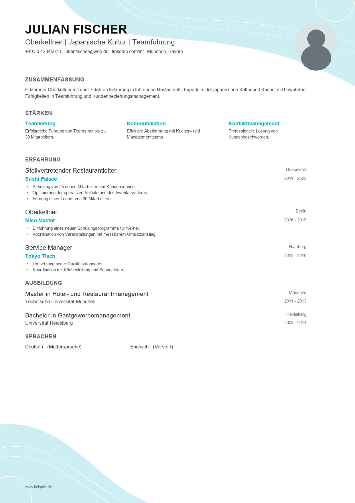
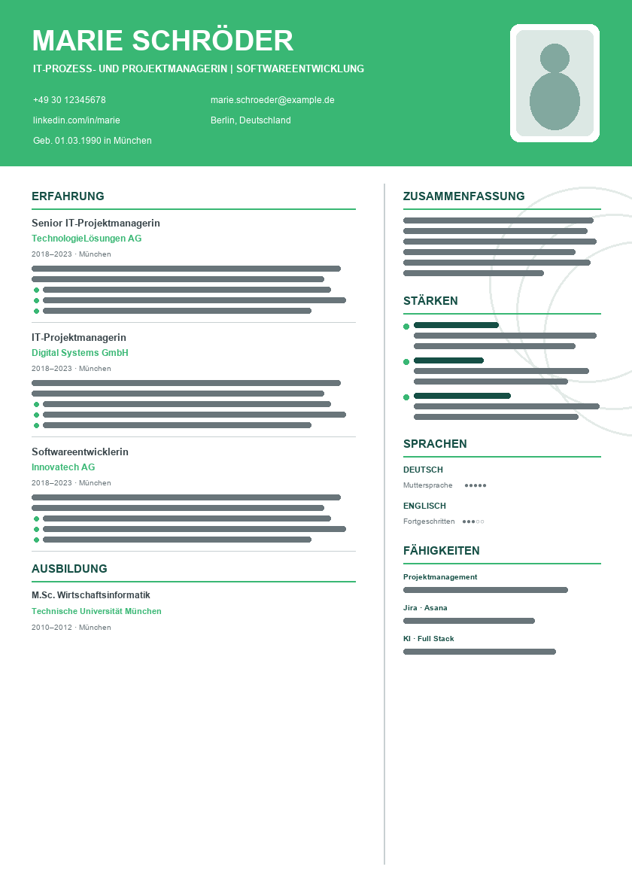
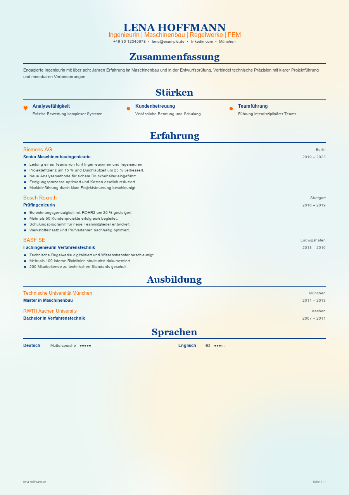

# BewerbungsManager

> Bewerbungen erstellen, organisieren und als professionelle Unterlagen exportieren – lokal auf Ihrem Windows-PC.

[](https://github.com/mustafa-oezdemir/bewerbung-studio/actions/workflows/ci.yml)
[](https://github.com/mustafa-oezdemir/bewerbung-studio/releases/latest)
[](LICENSE)


BewerbungsManager ist eine Desktop-Anwendung für den gesamten Bewerbungsablauf: von der Stellenanzeige und dem
Profil über Anschreiben, Deckblatt und Lebenslauf bis zur fertigen Bewerbungsmappe, mit Kalender und Aufgabenliste.
Alle Daten bleiben in einem Ordner auf Ihrem Rechner. Die Oberfläche ist auf Deutsch.

**[➡ Aktuelle Windows-Version herunterladen](https://github.com/mustafa-oezdemir/bewerbung-studio/releases/latest)**

## Download

Die aktuelle Version finden Sie unter [GitHub Releases](https://github.com/mustafa-oezdemir/bewerbung-studio/releases/latest).

| Datei | Verwendung |
| --- | --- |
| `BewerbungsManager-<Version>-x64-Setup.exe` | Normale Installation unter Windows: Installationsordner wählbar, Startmenü- und Desktop-Verknüpfung |
| `BewerbungsManager-<Version>-x64-Portable.exe` | Startet ohne Installation |
| `SHA256SUMS.txt` | Prüfsummen zur Integritätskontrolle |

Beide Varianten enthalten dieselbe Anwendung. Ihre Bewerbungsdaten liegen in einem Ordner, den Sie selbst wählen,
also außerhalb des Installationsordners.

> Die veröffentlichten Windows-Dateien sind derzeit nicht code-signiert. Windows kann deshalb eine
> SmartScreen-Warnung anzeigen. Prüfen Sie im Zweifel die SHA-256-Prüfsumme mit der veröffentlichten
> `SHA256SUMS.txt`:
>
> ```powershell
> Get-FileHash .\BewerbungsManager-<Version>-x64-Setup.exe -Algorithm SHA256
> ```

> **Funktionsstand:** Die Abschnitte [Workspace & Computerwechsel](#workspace--computerwechsel) und
> [Datensicherheit & Verschlüsselung](#datensicherheit--verschlüsselung) beschreiben den Stand nach Version 1.0.2,
> einschließlich der überarbeiteten Einstellungen. In Version 1.0.2 selbst sind Workspace-Auswahl, Computerwechsel
> und Verschlüsselung noch nicht enthalten.

## Warum BewerbungsManager?

- **Alles an einem Ort:** Firma, Stelle, Status, Termine, Dokumente und Aufgaben jeder Bewerbung.
- **Profil einmal pflegen:** Anschreiben, Deckblatt und Lebenslauf verwenden dieselben Profildaten.
- **Fertige Unterlagen:** Anschreiben als Word-Datei, Deckblatt und Lebenslauf als PDF, dazu eine komplette
  Bewerbungsmappe als ein PDF.
- **Fristen im Blick:** Bewerbungsfristen erscheinen automatisch im Kalender und in der Aufgabenliste.
- **Daten unter Ihrer Kontrolle:** lokaler Ordner, kein Benutzerkonto, optional mit Master-Passwort geschützt.

## Funktionen

### Bewerbungen

- Assistent zum Anlegen mit Validierung; ein angefangener Entwurf wird lokal zwischengespeichert
- Firma, Ansprechpartner und Stelle mit Referenz, Quelle, Link, Anzeigentext, Arbeitsmodell, Vertragsart und Gehalt
- Statusverlauf von *Entwurf* bis *Zusage*, *Absage*, *Zurückgezogen* oder *Archiviert*; Absagen mit Begründung
- Bewerbungsfrist, Gesprächs- und Vertragstermine
- Dashboard mit Statuszahlen und Erfolgsquote; Suche und Filter über alle Bewerbungen
- Abgleich der Stellenanzeige mit den Kenntnissen im Profil

### Dokumente

- **Anschreiben** als bearbeitbare Word-Datei (DOCX), befüllt mit den Bewerbungsdaten
- **Deckblatt** in drei Designs (Klassisch, Pastell, Akzentband); Vorschau und PDF nutzen dieselbe Darstellung
- **Lebenslauf** in mehreren Designs, mit Editor für Abschnitte (ein- und ausblendbar, sortierbar) und
  automatischem Seitenumbruch
- **Bewerbungsmappe** als ein zusammengeführtes PDF: Deckblatt, Anschreiben, Lebenslauf, Zeugnisse, Zertifikate
- **Zeugnisse und Zertifikate** liegen einmal zentral als PDF und werden pro Bewerbung nur verknüpft
- E-Mail-Text zur Bewerbung als Markdown-Datei

Mitgelieferte Word-Muster für den Lebenslauf (Beispieldaten) liegen in
[`bewerbung-studio/public/templates`](bewerbung-studio/public/templates):

<p>
  
  
  
</p>

### Organisation

- **Kalender** als Monats- und Agendaansicht
- **Bewerbungsfrist:** Sie erzeugt automatisch einen Kalendertermin und eine Aufgabe mit hoher Priorität im ToDo;
  ändern oder entfernen Sie die Frist, folgen beide
- **ToDo** mit Priorität, Fälligkeit und Notiz; Aufgaben zu Bewerbungen und eigene Aufgaben sind getrennt filterbar
- Nach *Absage*, *Zusage*, *Zurückgezogen* oder *Archiviert* gelten die automatischen Aufgaben der Bewerbung nicht
  mehr als aktiv; wird der Status zurückgenommen, erscheinen sie wieder
- Erinnerung zum Nachfassen nach einer einstellbaren Anzahl von Tagen
- Desktop-Benachrichtigungen für Kalendertermine mit Erinnerung

### Datenverwaltung

- Mehrere Profile; jede Bewerbung verwendet genau ein Profil für alle ihre Dokumente
- Frei wählbarer Bewerbungsordner (Workspace) und Computerwechsel
- Automatische tägliche Sicherung, vollständige Sicherung und JSON-Export
- Optionale Verschlüsselung mit Master-Passwort
- Hell-, Dunkel- und Systemdesign

## Schnellstart

1. Setup- oder Portable-Version herunterladen und die Prüfsumme kontrollieren.
2. Anwendung starten.
3. Den Bewerbungsordner wählen, in dem alle Bewerbungsdaten gespeichert werden.
4. Optional die Verschlüsselung aktivieren.
5. Ein Profil anlegen.
6. Die erste Bewerbung erstellen.

## Daten & Datenschutz

BewerbungsManager verarbeitet persönliche Daten wie Adresse, Telefonnummer, E-Mail, Lebenslauf, Zeugnisse und
Bewerbungsunterlagen.

- Die Daten liegen lokal im gewählten Bewerbungsordner. Sie können ihn jederzeit wechseln.
- Es gibt kein Benutzerkonto und keine Cloud-Synchronisierung.
- Der Quellcode enthält keine Telemetrie und keinen automatischen Update-Abruf. Netzwerkzugriffe gibt es nur über
  Links, die Sie selbst öffnen.
- Automatische und manuelle Sicherungen sind eingebaut, die Verschlüsselung ist optional (siehe unten).

Die Anwendung überträgt den Bewerbungsordner nicht automatisch an ein Git-Remote.
Ein früher eingerichtetes Git-Repository oder frühere Commits bleiben auf dem Datenträger;
entfernen Sie diese bei Bedarf separat und prüfen Sie bereits veröffentlichte Remotes.

## Workspace & Computerwechsel

BewerbungsManager führt den gesamten Datenbestand zentral in der Datei `workspace.json`. Diese Datei enthält
Bewerbungen, Profile, Aufgaben und Einstellungen, aber **nicht** die Dokumente selbst. Anschreiben, Zeugnisse und
andere Dateien liegen als eigene Dateien im Bewerbungsordner.

### Auf einem anderen Computer weiterarbeiten

1. Unter **Einstellungen → Übertragen & Sicherung** mit **Für anderen Computer kopieren …** den vollständigen
   Datenbestand in einen Zielordner kopieren, oder den gesamten Bewerbungsordner selbst kopieren bzw. sicher
   synchronisieren.
2. BewerbungsManager auf dem neuen Computer starten.
3. Auf dem Startbildschirm oder unter **Einstellungen → Datenbestand & Workspace** die Schaltfläche
   **Workspace-Datei auswählen …** wählen und die `workspace.json` aus dem kopierten Ordner auswählen.
4. Der Datenbestand wird aus dem neuen Speicherort geladen. Ist er verschlüsselt, folgt die Abfrage von
   Master-Passwort oder Wiederherstellungsschlüssel.

Mit **Einstellungen → Speicherort → Speicherort ändern …** verlegen Sie den Bewerbungsordner auf demselben Computer.
Vorher wird eine vollständige Sicherung erstellt; der bisherige Ordner bleibt erhalten. Bei aktiver Verschlüsselung
kopieren Sie den Datenbestand stattdessen und öffnen die Kopie über **Workspace-Datei auswählen …**.

### Aufbau des Bewerbungsordners

```text
<Bewerbungsordner>/
└── data/
    ├── Bewerbungen/            eine Stelle pro Unterordner: Anschreiben, Lebenslauf, Deckblatt, E-Mail, ...
    ├── Zeugnisse/
    ├── Zertifikate/
    ├── Absagen/
    └── Setting/
        ├── Settings/
        │   └── workspace.json  zentraler Datensatz
        ├── Profile/
        ├── Backups/
        └── Muster/             Vorlagen
```

Weitere Hintergründe zur Ablage stehen in [`bewerbung-studio/README.md`](bewerbung-studio/README.md).

## Datensicherheit & Verschlüsselung

Optional kann der Datenbestand mit einem Master-Passwort geschützt werden. Sie wählen das beim ersten Einrichten
oder später unter **Einstellungen → Datensicherheit & Verschlüsselung**.

- **Verfahren:** AES-256-GCM für Daten und Dateien; Argon2id leitet aus dem Master-Passwort den Schlüssel ab, der
  einen zufälligen Datenschlüssel schützt.
- **Master-Passwort:** mindestens 14 Zeichen.
- **Wiederherstellungsschlüssel:** wird bei der Aktivierung angezeigt, lässt sich kopieren oder als TXT speichern
  und entsperrt den Datenbestand, wenn das Passwort fehlt. Verlieren Sie Passwort und Schlüssel, gibt es keine
  Wiederherstellung.
- **Automatisch sperren:** nach 5, 15 (Standard), 30 oder 60 Minuten oder nie; der Datenbestand lässt sich auch
  manuell sperren.
- **Auf diesem Gerät merken:** optional, über den Windows-Geräteschutz (Electron `safeStorage`). Der Schlüssel liegt
  nicht im Bewerbungsordner.
- **Sicherungen:** die verwalteten Sicherungen im Datenordner werden mitverschlüsselt.
- **Computerwechsel:** der Datenbestand bleibt portabel. Auf dem neuen Computer entsperren Sie ihn mit
  Master-Passwort oder Wiederherstellungsschlüssel.

### Grenzen

Die Verschlüsselung schützt die Inhalte des verwalteten `data`-Ordners. Sie ist kein Schutz gegen alles:

- Ordner- und Dateinamen bleiben sichtbar.
- Dateien, die Sie bewusst aus dem Datenbestand exportieren (PDF, DOCX, JSON-Sicherung, Einstellungen), liegen
  außerhalb davon unverschlüsselt vor.
- Öffnen Sie ein Dokument in einem externen Programm (zum Beispiel Word), liegt dafür vorübergehend eine
  entschlüsselte Kopie außerhalb des Bewerbungsordners. Sie wird nach einer Stunde sowie beim Beenden und beim
  nächsten Start entfernt. Auf SSDs lässt sich das Löschen nicht garantieren.
- Frühere unverschlüsselte Dateiversionen, Kopien und Git-Commits werden nicht rückwirkend entfernt.
- Bei entsperrter Anwendung oder einem kompromittierten Betriebssystem bietet die Verschlüsselung keinen
  vollständigen Schutz.
- Die Anwendung führt keine automatische Git-Synchronisierung des Bewerbungsordners aus.

Legen Sie vor der ersten Aktivierung zusätzlich eine eigene externe Sicherung an.

## Backup & Wiederherstellung

Unter **Einstellungen → Übertragen & Sicherung**:

- **Tägliche automatische JSON-Sicherung** des Datenbestands (`workspace-JJJJ-MM-TT.json`) im Ordner
  `data/Setting/Backups`; die Zahl der aufbewahrten Sicherungen ist einstellbar (3 bis 50).
- **Jetzt sichern** erstellt eine vollständige Sicherung des Bewerbungsordners im Backup-Ordner, mit Prüfsummen
  aller Dateien.
- **JSON-Sicherung exportieren** und **Sicherung wiederherstellen** (der aktuelle Stand wird vorher automatisch
  gesichert) sowie Export und Import der Einstellungen.
- Beim Löschen einer Bewerbung werden ihre Daten zuvor als JSON archiviert (Ordner `Silinenler`).

Eine eigene Sicherung des gesamten Bewerbungsordners an einem zweiten Ort bleibt empfehlenswert.

## Systemvoraussetzungen

- Windows 10 oder 11, 64 Bit (x64)

Andere Betriebssysteme und Architekturen werden nicht veröffentlicht.

## Entwicklung

Voraussetzungen: [Node.js](https://nodejs.org/) 24 (wie in der CI), npm und Git. Die Anwendung liegt im
Unterordner `bewerbung-studio`.

```bash
git clone https://github.com/mustafa-oezdemir/bewerbung-studio.git
cd bewerbung-studio/bewerbung-studio
npm ci
npm run dev
```

`npm run dev` startet Vite mit dem Electron-Plugin und öffnet die Desktop-Anwendung. `npm start` startet die bereits
gebaute Anwendung und braucht vorher `npm run build`. Nur die Oberfläche im Browser, ohne Electron:

```powershell
$env:VITE_RENDERER_ONLY="1"; npm run dev
```

Für Entwicklung und Tests lässt sich der Datenordner über die Umgebungsvariable `BEWERBUNG_ROOT_PATH` setzen.
Verwenden Sie dafür nie Ihre echten Bewerbungsdaten.

### Skripte

Alle Skripte laufen im Anwendungsordner, also dem Ordner mit der `package.json`.

| Befehl | Zweck |
| --- | --- |
| `npm run dev` | Entwicklungsmodus mit Electron |
| `npm start` | Gebaute Electron-Anwendung starten |
| `npm run build` | Typprüfung und Production Build |
| `npm run typecheck` | TypeScript prüfen |
| `npm test` | Tests ausführen (Vitest) |
| `npm run release:check` | Typecheck, Tests und Build |
| `npm run dist:win` | Windows-Release erzeugen (Setup, Portable, Prüfsummen) |
| `npm run dist:win:signed` | Wie `dist:win`, mit Code-Signing (Zertifikat nötig) |
| `npm run dist:win:installer` | Nur den Installer bauen |
| `npm run dist:win:portable` | Nur die portable Version bauen |

Die Technik im Überblick: Electron, React, TypeScript (strict), Vite, Tailwind CSS, Zustand und Zod; Dokumente mit
docxtemplater, PizZip und pdf-lib. Die genauen Versionen stehen in
[`bewerbung-studio/package.json`](bewerbung-studio/package.json).

## Tests

```bash
npm test
```

im Anwendungsordner (siehe [Entwicklung](#entwicklung)). Die Tests laufen mit Vitest und liegen neben dem Code (`*.test.ts`, `*.test.tsx`). Vor einem Pull Request sollte
`npm run release:check` durchlaufen.

## CI/CD & Release

```text
PR / codex/clean-release
→ CI
→ Typecheck
→ Tests
→ Build

vX.Y.Z (Tag)
→ Windows Release
→ Setup
→ Portable
→ SHA256
→ GitHub Release
```

Die Workflows [`ci.yml`](.github/workflows/ci.yml) und [`release.yml`](.github/workflows/release.yml) rufen die
vorhandenen npm-Skripte auf. Ohne hinterlegte Signing-Secrets entstehen unsignierte Dateien. Checkliste, Signierung
und der genaue Ablauf stehen in [`bewerbung-studio/RELEASE.md`](bewerbung-studio/RELEASE.md). Änderungen einer
einzelnen Version stehen in den Release Notes auf GitHub, nicht in dieser Datei.

## Projektstruktur

```text
bewerbung-studio/
├── .github/
│   ├── ISSUE_TEMPLATE/
│   ├── workflows/               CI und Windows-Release
│   └── pull_request_template.md
├── bewerbung-studio/            die Anwendung
│   ├── electron/                Main Process: Speicher, Dateien, PDF/DOCX, Vorlagen, Verschlüsselung
│   ├── src/
│   │   ├── views/               Dashboard, Bewerbungen, Kalender, ToDo, Dokumente, Profil, Einstellungen
│   │   ├── components/          Assistent, Lebenslauf-Vorlagen, Deckblatt
│   │   └── shared/              Schemas, Fachregeln, Seitenumbruch
│   ├── scripts/                 Release-Build, Prüfsummen, QA-Skripte
│   ├── public/templates/        Word-Muster
│   ├── package.json
│   └── RELEASE.md
├── CODE_OF_CONDUCT.md
├── CONTRIBUTING.md
├── LICENSE
├── NOTICE
├── README.md
└── SECURITY.md
```

## Mitwirken

Beiträge sind willkommen. Siehe [CONTRIBUTING.md](CONTRIBUTING.md). Es gilt der
[Verhaltenskodex](CODE_OF_CONDUCT.md). Committen Sie keine echten Bewerbungsdaten und veröffentlichen Sie sie nicht in
Issues oder Pull Requests.

## Sicherheit

Sicherheitslücken bitte nicht öffentlich melden.
Weitere Informationen: [SECURITY.md](SECURITY.md)

## Lizenz

BewerbungsManager ist unter der Apache License 2.0 veröffentlicht.

Siehe [LICENSE](LICENSE) und [NOTICE](NOTICE).
